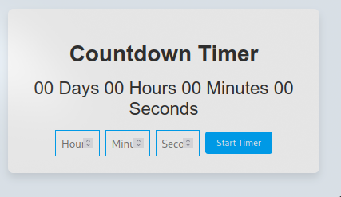

# Countdown Timer

## Deskripsi

Countdown Timer adalah aplikasi yang memungkinkan pengguna untuk menghitung mundur waktu dari jam, menit, dan detik yang ditentukan. Setelah waktu habis, aplikasi akan menampilkan pesan peringatan. Aplikasi ini cocok untuk berbagai keperluan, seperti pengingat, timer untuk memasak, dan lain-lain.

 <!-- Ganti dengan path gambar Anda -->

## Daftar Isi

1. [Fitur](#fitur)
2. [Teknologi yang Digunakan](#teknologi-yang-digunakan)
3. [Penjelasan Kode](#penjelasan-kode)
4. [Penggunaan](#penggunaan)
5. [Kesimpulan](#kesimpulan)

## Fitur

- Pengguna dapat memasukkan waktu dalam jam, menit, dan detik.
- Timer menghitung mundur dan menampilkan waktu tersisa dalam format yang mudah dibaca.
- Notifikasi saat waktu habis.

## Teknologi yang Digunakan

- HTML
- CSS
- JavaScript

## Penjelasan Kode

Berikut adalah penjelasan dari kode yang digunakan dalam proyek ini:

```javascript
// Mendapatkan elemen-elemen HTML
const countdownElement = document.getElementById("countdown");
const daysElement = document.getElementById("days");
const hoursElement = document.getElementById("hours");
const minutesElement = document.getElementById("minutes");
const secondsElement = document.getElementById("seconds");
const inputHours = document.getElementById("inputHours");
const inputMinutes = document.getElementById("inputMinutes");
const inputSeconds = document.getElementById("inputSeconds");
const startButton = document.getElementById("startButton");

let countdownInterval;

/**
 * Fungsi untuk memulai timer
 */
function startTimer() {
  let hours = parseInt(inputHours.value) || 0;
  let minutes = parseInt(inputMinutes.value) || 0;
  let seconds = parseInt(inputSeconds.value) || 0;

  let totalTimeInSeconds = hours * 3600 + minutes * 60 + seconds;

  if (totalTimeInSeconds <= 0) {
    alert("Please enter a valid time.");
    return;
  }

  inputHours.value = "";
  inputMinutes.value = "";
  inputSeconds.value = "";

  /**
   * Fungsi untuk memperbarui tampilan setiap detik
   */
  countdownInterval = setInterval(() => {
    const days = Math.floor(totalTimeInSeconds / 86400);
    const hours = Math.floor((totalTimeInSeconds % 86400) / 3600);
    const minutes = Math.floor((totalTimeInSeconds % 3600) / 60);
    const seconds = Math.floor(totalTimeInSeconds % 60);

    daysElement.textContent = days.toString().padStart(2, "0");
    hoursElement.textContent = hours.toString().padStart(2, "0");
    minutesElement.textContent = minutes.toString().padStart(2, "0");
    secondsElement.textContent = seconds.toString().padStart(2, "0");

    totalTimeInSeconds--;

    if (totalTimeInSeconds < 0) {
      clearInterval(countdownInterval);
      alert("Waktu Habis!");
    }
  }, 1000); // Interval waktu dalam milidetik (1000 ms = 1 detik)
}

// Menambahkan event listener pada tombol start
startButton.addEventListener("click", () => {
  clearInterval(countdownInterval);
  startTimer();
});
```

### Penjelasan Kode:

1. **Mendapatkan Elemen DOM**:

   - Mengambil elemen-elemen HTML yang diperlukan untuk menampilkan waktu dan mengambil input pengguna.

2. **Fungsi `startTimer`**:

   - Mengambil input jam, menit, dan detik dari pengguna, lalu menghitung total waktu dalam detik.
   - Memeriksa validitas waktu yang dimasukkan.
   - Mengatur interval untuk memperbarui tampilan setiap detik.

3. **Interval Countdown**:
   - Menghitung sisa waktu dan memperbarui elemen HTML dengan nilai yang tersisa.
   - Menghentikan timer dan menampilkan notifikasi saat waktu habis.

## Penggunaan

1. Siapkan file HTML dengan elemen-elemen yang sesuai, seperti input untuk jam, menit, dan detik, serta tombol untuk memulai timer.
2. Salin kode JavaScript di atas ke dalam file JavaScript terpisah.
3. Buka file HTML di browser untuk melihat dan menggunakan Countdown Timer.

## Kesimpulan

Countdown Timer adalah alat yang berguna untuk menghitung mundur waktu dan memberikan notifikasi saat waktu habis. Dengan menggunakan JavaScript, aplikasi ini menawarkan pengalaman pengguna yang sederhana namun efektif.
