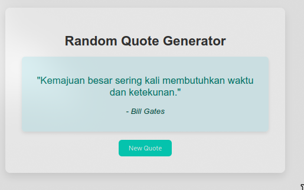

# Random Quotes Generator

## Deskripsi

Random Quotes Generator adalah aplikasi web sederhana yang menampilkan kutipan inspiratif beserta nama penulisnya. Pengguna dapat mengklik tombol untuk mendapatkan kutipan baru secara acak. Aplikasi ini bertujuan untuk memberikan motivasi dan inspirasi bagi penggunanya.



## Daftar Isi

1. [Fitur](#fitur)
2. [Teknologi yang Digunakan](#teknologi-yang-digunakan)
3. [Penjelasan Kode](#penjelasan-kode)
4. [Penggunaan](#penggunaan)
5. [Kesimpulan](#kesimpulan)

## Fitur

- Menampilkan kutipan secara acak dari daftar kutipan yang telah ditentukan.
- Tombol untuk menghasilkan kutipan baru.
- Tampilan yang sederhana dan mudah digunakan.

## Teknologi yang Digunakan

- HTML
- CSS
- JavaScript

## Penjelasan Kode

Berikut adalah penjelasan dari kode yang digunakan dalam proyek ini:

```javascript
// Array yang menyimpan daftar kutipan (quotes) beserta penulisnya (author)
const quotes = [
  {
    text: "Kita tidak pernah berhenti belajar karena belajar itu sendiri adalah proses yang tidak ada habisnya.",
    author: "Albert Einstein",
  },
  // ... (daftar kutipan lainnya)
];

// Mendapatkan elemen HTML berdasarkan id-nya
const quoteText = document.getElementById("quote");
const quoteAuthor = document.getElementById("author");
const newQuoteButton = document.getElementById("new-quote");

// Fungsi untuk menghasilkan kutipan secara acak
function generateQuote() {
  const randomIndex = Math.floor(Math.random() * quotes.length);
  const randomQuote = quotes[randomIndex];

  // Mengupdate elemen HTML dengan teks kutipan dan nama penulisnya
  quoteText.textContent = `"${randomQuote.text}"`;
  quoteAuthor.textContent = `- ${randomQuote.author}`;
}

// Menambahkan event listener ke tombol
newQuoteButton.addEventListener("click", generateQuote);

// Memanggil fungsi generateQuote ketika halaman pertama kali dimuat
generateQuote();
```

### Penjelasan Kode:

1. **Array Kutipan**:

   - Mendefinisikan array `quotes` yang berisi objek-objek kutipan dengan properti `text` dan `author`.

2. **Mendapatkan Elemen HTML**:

   - Menggunakan `document.getElementById()` untuk mendapatkan elemen-elemen HTML yang akan digunakan untuk menampilkan kutipan.

3. **Fungsi `generateQuote`**:

   - Menghasilkan indeks acak untuk memilih kutipan dari array.
   - Memperbarui elemen HTML dengan teks dan penulis kutipan yang terpilih.

4. **Event Listener**:

   - Menambahkan event listener pada tombol yang memanggil fungsi `generateQuote` ketika tombol diklik.

5. **Memanggil Fungsi Pertama Kali**:
   - Memanggil `generateQuote()` saat halaman dimuat agar pengguna langsung melihat kutipan awal.

## Penggunaan

1. Pastikan Anda memiliki file HTML yang berisi elemen dengan id `quote`, `author`, dan `new-quote`.
2. Salin kode di atas ke dalam file JavaScript.
3. Buka file HTML di browser untuk mencoba aplikasi.

## Kesimpulan

Random Quotes Generator adalah aplikasi sederhana namun efektif untuk memberikan inspirasi kepada penggunanya. Dengan menggunakan JavaScript, aplikasi ini memberikan pengalaman interaktif yang menyenangkan dan dapat memperkaya motivasi sehari-hari.
