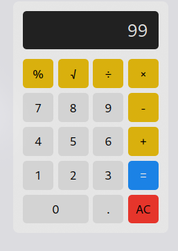

# Kalkulator Sederhana

## Deskripsi

Kalkulator Sederhana adalah aplikasi web yang memungkinkan pengguna untuk melakukan operasi aritmatika dasar seperti penjumlahan, pengurangan, perkalian, dan pembagian. Kalkulator ini juga mendukung operasi desimal, akar kuadrat, dan persentase.



## Daftar Isi

1. [Fitur](#fitur)
2. [Teknologi yang Digunakan](#teknologi-yang-digunakan)
3. [Penjelasan Kode](#penjelasan-kode)
4. [Penggunaan](#penggunaan)
5. [Kesimpulan](#kesimpulan)

## Fitur

- Operasi dasar: Penjumlahan, pengurangan, perkalian, pembagian.
- Mendukung angka desimal.
- Menampilkan hasil dengan 7 angka desimal.
- Fitur reset untuk menghapus semua input.
- Fitur akar kuadrat dan persentase.

## Teknologi yang Digunakan

- HTML
- CSS
- JavaScript

## Penjelasan Kode

Berikut adalah penjelasan dari kode yang digunakan dalam proyek ini:

```javascript
// Objek utama yang menyimpan status dari kalkulator
const calculator = {
  displayValue: "0", // Nilai yang ditampilkan di layar kalkulator
  firstOperand: null, // Operand pertama
  waitingForSecondOperand: false, // Menunggu operand kedua
  operator: null, // Operator yang digunakan
};

// Fungsi untuk memperbarui tampilan layar kalkulator
function updateDisplay() {
  const display = document.querySelector(".calculator-display");
  display.value = calculator.displayValue; // Set nilai display
}

// Fungsi untuk menangani masukan digit angka
function inputDigit(digit) {
  const { displayValue, waitingForSecondOperand } = calculator;
  if (waitingForSecondOperand) {
    calculator.displayValue = digit; // Mulai nilai baru
    calculator.waitingForSecondOperand = false;
  } else {
    calculator.displayValue =
      displayValue === "0" ? digit : displayValue + digit; // Hindari awalan 0
  }
  updateDisplay(); // Perbarui tampilan
}

// Fungsi untuk menangani masukan desimal
function inputDecimal(dot) {
  if (!calculator.displayValue.includes(dot)) {
    calculator.displayValue += dot; // Tambahkan titik desimal
  }
}

// Fungsi untuk menangani operator aritmatika
function handleOperator(nextOperator) {
  const { firstOperand, displayValue, operator } = calculator;
  const inputValue = parseFloat(displayValue);

  if (operator && calculator.waitingForSecondOperand) {
    calculator.operator = nextOperator;
    return;
  }

  if (firstOperand === null && !isNaN(inputValue)) {
    calculator.firstOperand = inputValue;
  } else if (operator) {
    const result = calculate(firstOperand, inputValue, operator);
    calculator.displayValue = `${parseFloat(result.toFixed(7))}`;
    calculator.firstOperand = result;
  }

  calculator.waitingForSecondOperand = true;
  calculator.operator = nextOperator;
  updateDisplay();
}

// Fungsi untuk menghitung hasil berdasarkan operator
function calculate(firstOperand, secondOperand, operator) {
  if (operator === "+") {
    return firstOperand + secondOperand;
  } else if (operator === "-") {
    return firstOperand - secondOperand;
  } else if (operator === "*") {
    return firstOperand * secondOperand;
  } else if (operator === "/") {
    return firstOperand / secondOperand;
  } else if (operator === "√") {
    return Math.sqrt(firstOperand);
  } else if (operator === "%") {
    return firstOperand / 100;
  }
  return secondOperand;
}

// Fungsi untuk mereset kalkulator
function resetCalculator() {
  calculator.displayValue = "0";
  calculator.firstOperand = null;
  calculator.waitingForSecondOperand = false;
  calculator.operator = null;
  updateDisplay();
}

// Fungsi untuk menangani operasi "="
function handleEqual() {
  const { firstOperand, displayValue, operator } = calculator;
  const inputValue = parseFloat(displayValue);

  if (operator && !calculator.waitingForSecondOperand) {
    const result = calculate(firstOperand, inputValue, operator);
    calculator.displayValue = `${parseFloat(result.toFixed(7))}`;
    calculator.firstOperand = null;
    calculator.operator = null;
    calculator.waitingForSecondOperand = false;
    updateDisplay();
  }
}

// Event listener untuk menangani klik tombol
document
  .querySelector(".calculator-keys")
  .addEventListener("click", (event) => {
    const { target } = event;

    if (!target.matches("button")) {
      return;
    }

    if (target.classList.contains("operator")) {
      handleOperator(target.value);
      return;
    }

    if (target.classList.contains("decimal")) {
      inputDecimal(target.value);
      return;
    }

    if (target.classList.contains("all-clear")) {
      resetCalculator();
      return;
    }

    if (target.classList.contains("equal-sign")) {
      handleEqual();
      return;
    }

    inputDigit(target.value);
  });
```

### Penjelasan Kode:

1. **Objek Kalkulator**: Menyimpan status kalkulator, termasuk nilai yang ditampilkan, operand pertama, dan operator yang digunakan.
2. **Fungsi `updateDisplay`**: Memperbarui tampilan layar kalkulator dengan nilai terkini.

3. **Fungsi `inputDigit` dan `inputDecimal`**: Mengatur masukan angka dan titik desimal, serta memperbarui tampilan.

4. **Fungsi `handleOperator`**: Menangani logika saat operator ditekan dan melakukan perhitungan jika diperlukan.

5. **Fungsi `calculate`**: Melakukan perhitungan berdasarkan dua operand dan operator yang dipilih.

6. **Fungsi `resetCalculator`**: Mengembalikan kalkulator ke kondisi awal.

7. **Fungsi `handleEqual`**: Menghitung hasil akhir ketika tombol "=" ditekan.

8. **Event Listener**: Menangani klik pada tombol kalkulator dan memanggil fungsi yang sesuai berdasarkan jenis tombol yang ditekan.

## Penggunaan

1. Siapkan file HTML dengan elemen untuk tampilan kalkulator dan tombol-tombol operasi.
2. Salin kode JavaScript di atas ke dalam file JavaScript terpisah.
3. Buka file HTML di browser untuk menggunakan kalkulator.

## Kesimpulan

Kalkulator Sederhana adalah aplikasi yang menyenangkan dan berguna untuk melakukan perhitungan dasar. Dengan antarmuka yang mudah digunakan dan logika yang jelas, aplikasi ini menjadi alat yang baik untuk belajar tentang pengembangan web dan JavaScript.
