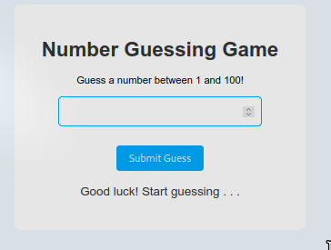

# Number Guessing Game

## Deskripsi

Number Guessing Game adalah permainan sederhana di mana pemain harus menebak angka acak yang dihasilkan oleh komputer antara 1 dan 100. Pemain akan menerima petunjuk apakah tebakan mereka terlalu tinggi atau terlalu rendah. Permainan ini memberikan pengalaman interaktif yang menyenangkan dan menguji kemampuan berpikir logis.

 <!-- Ganti dengan path gambar Anda -->

## Daftar Isi

1. [Fitur](#fitur)
2. [Teknologi yang Digunakan](#teknologi-yang-digunakan)
3. [Penjelasan Kode](#penjelasan-kode)
4. [Penggunaan](#penggunaan)
5. [Kesimpulan](#kesimpulan)

## Fitur

- Menghasilkan angka acak antara 1 dan 100.
- Memberikan petunjuk apakah tebakan terlalu tinggi atau rendah.
- Menampilkan jumlah percobaan yang dilakukan.
- Opsi untuk mereset permainan dan bermain ulang.

## Teknologi yang Digunakan

- HTML
- CSS
- JavaScript

## Penjelasan Kode

Berikut adalah penjelasan dari kode yang digunakan dalam proyek ini:

```javascript
// Menghasilkan angka acak antara 1 dan 100
let randomNumber = Math.floor(Math.random() * 100) + 1;
let attempts = 0; // Variabel untuk menghitung jumlah percobaan

// Mendapatkan elemen HTML yang akan digunakan
const guessInput = document.getElementById("guessInput"); // Input untuk tebakan pengguna
const guessButton = document.getElementById("guessButton"); // Tombol untuk submit tebakan
const message = document.getElementById("message"); // Elemen untuk menampilkan pesan hasil
const restartButton = document.getElementById("restartButton"); // Tombol untuk mereset permainan

// Fungsi untuk memeriksa tebakan pengguna
function checkGuess() {
  const userGuess = Number(guessInput.value); // Mengubah input menjadi angka
  attempts++; // Menambah jumlah percobaan

  // Jika tebakan benar
  if (userGuess === randomNumber) {
    message.textContent = `Congratulations! You guessed the number ${randomNumber} correctly in ${attempts} attempts.`; // Pesan sukses
    message.style.color = "#28a745"; // Warna pesan hijau
    endGame(); // Mengakhiri permainan
  }
  // Jika tebakan terlalu tinggi
  else if (userGuess > randomNumber) {
    message.textContent = "Too high! Try again."; // Pesan jika terlalu tinggi
    message.style.color = "#dc3545"; // Warna pesan merah
  }
  // Jika tebakan terlalu rendah
  else if (userGuess < randomNumber) {
    message.textContent = "Too low! Try again."; // Pesan jika terlalu rendah
    message.style.color = "#dc3545"; // Warna pesan merah
  }

  guessInput.value = ""; // Mengosongkan input
  guessInput.focus(); // Memfokuskan kembali input
}

// Fungsi untuk mengakhiri permainan
function endGame() {
  guessInput.disabled = true; // Mematikan input
  guessButton.disabled = true; // Mematikan tombol submit
  restartButton.style.display = "inline"; // Menampilkan tombol restart
}

// Fungsi untuk mereset permainan
function resetGame() {
  attempts = 0; // Reset percobaan
  randomNumber = Math.floor(Math.random() * 100) + 1; // Menghasilkan angka baru
  guessInput.disabled = false; // Mengaktifkan input
  guessButton.disabled = false; // Mengaktifkan tombol submit
  message.textContent = "Good luck! Start guessing . . ."; // Pesan default
  message.style.color = "#333"; // Warna pesan default
  restartButton.style.display = "none"; // Menyembunyikan tombol restart
  guessInput.value = ""; // Mengosongkan input
  guessInput.focus(); // Fokus kembali ke input
}

// Event listener untuk memeriksa tebakan ketika tombol diklik
guessButton.addEventListener("click", checkGuess);

// Event listener untuk mereset permainan ketika tombol restart diklik
restartButton.addEventListener("click", resetGame);

// Event listener untuk memeriksa tebakan saat pengguna menekan Enter
guessInput.addEventListener("keydown", function (event) {
  if (event.key === "Enter") {
    checkGuess();
  }
});
```

### Penjelasan Kode:

1. **Menghasilkan Angka Acak**:

   - Menggunakan `Math.random()` untuk menghasilkan angka acak antara 1 dan 100.

2. **Mendapatkan Elemen HTML**:

   - Mengambil elemen input, tombol, dan elemen pesan menggunakan `document.getElementById()`.

3. **Fungsi `checkGuess`**:

   - Memeriksa tebakan pengguna dan memberikan umpan balik (terlalu tinggi, terlalu rendah, atau benar).
   - Menambah jumlah percobaan setiap kali pengguna memasukkan tebakan.

4. **Fungsi `endGame` dan `resetGame`**:

   - Mengatur status permainan ketika tebakan benar dan memberikan opsi untuk memulai permainan ulang.

5. **Event Listeners**:
   - Menambahkan event listener untuk tombol dan input agar pengguna dapat berinteraksi dengan permainan.

## Penggunaan

1. Pastikan Anda memiliki file HTML dengan elemen yang diperlukan (input, tombol, dan area untuk pesan).
2. Salin kode di atas ke dalam file JavaScript.
3. Buka file HTML di browser untuk mencoba permainan.

## Kesimpulan

Number Guessing Game adalah permainan yang menyenangkan dan sederhana untuk menguji kemampuan menebak. Dengan menggunakan JavaScript, permainan ini dapat memberikan pengalaman interaktif kepada pemain.
