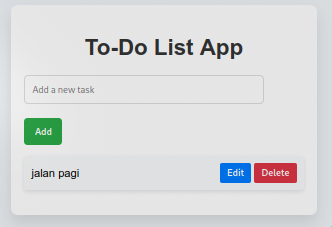

# README untuk Aplikasi Todo List



## Deskripsi

Aplikasi Todo List adalah alat sederhana untuk membantu pengguna mengelola tugas sehari-hari. Dengan aplikasi ini, pengguna dapat menambahkan, mengedit, dan menghapus tugas. Semua data tugas disimpan di local storage, sehingga tetap tersedia meskipun pengguna menutup atau merefresh halaman.

## Fitur Utama

- **Menambahkan Tugas**: Pengguna dapat memasukkan tugas baru.
- **Mengedit Tugas**: Pengguna dapat mengubah teks dari tugas yang ada.
- **Menghapus Tugas**: Pengguna dapat menghapus tugas dari daftar.
- **Penyimpanan Lokal**: Tugas disimpan secara permanen di local storage.

## Struktur Kode

### 1. Inisialisasi Variabel

```javascript
let currentEditElement = null; // Variabel untuk menyimpan elemen yang sedang diedit
```

- Variabel ini digunakan untuk menyimpan referensi ke tugas yang sedang diedit. Ini membantu saat kita perlu memperbarui teks tugas setelah pengguna melakukan perubahan.

### 2. Memuat Tugas saat Halaman Dimuat

```javascript
document.addEventListener("DOMContentLoaded", () => {
  loadTasksFromLocalStorage(); // Memuat tugas dari local storage saat halaman dimuat
});
```

- Menggunakan `DOMContentLoaded`, kita memastikan bahwa semua elemen HTML sudah siap sebelum kita mencoba memuat tugas.

### 3. Memuat Tugas dari Local Storage

```javascript
function loadTasksFromLocalStorage() {
  let tasks = JSON.parse(localStorage.getItem("tasks")) || []; // Mengambil tugas dari local storage
  tasks.forEach((task) => {
    const li = createTaskElement(task); // Membuat elemen list untuk setiap tugas
    document.getElementById("todo-list").appendChild(li); // Menambahkan elemen list ke daftar
  });
}
```

- Fungsi ini mengambil data tugas dari local storage. Jika tidak ada data, kita menggunakan array kosong. Setiap tugas yang diambil akan diubah menjadi elemen list dan ditambahkan ke tampilan.

### 4. Membuat Elemen Tugas

```javascript
function createTaskElement(task) {
  const li = document.createElement("li"); // Membuat elemen list untuk tugas
  const span = document.createElement("span"); // Membuat elemen span untuk teks tugas
  span.textContent = task; // Menetapkan teks tugas

  // Membuat tombol Edit
  const editBtn = document.createElement("button");
  editBtn.textContent = "Edit"; // Menetapkan teks tombol
  editBtn.classList.add("edit-btn"); // Menambahkan kelas CSS
  editBtn.onclick = () => openModal(li, span); // Menetapkan fungsi untuk tombol Edit

  // Membuat tombol Delete
  const deleteBtn = document.createElement("button");
  deleteBtn.textContent = "Delete"; // Menetapkan teks tombol
  deleteBtn.classList.add("delete-btn"); // Menambahkan kelas CSS
  deleteBtn.onclick = () => {
    li.remove(); // Menghapus elemen list dari tampilan
    deleteTaskFromLocalStorage(task); // Menghapus tugas dari local storage
  };

  // Membuat div untuk menampung tombol
  const buttons = document.createElement("div");
  buttons.classList.add("buttons"); // Menambahkan kelas CSS
  buttons.appendChild(editBtn); // Menambahkan tombol Edit
  buttons.appendChild(deleteBtn); // Menambahkan tombol Delete

  li.appendChild(span); // Menambahkan span ke dalam elemen list
  li.appendChild(buttons); // Menambahkan div tombol ke dalam elemen list

  return li; // Mengembalikan elemen list yang telah dibuat
}
```

- Fungsi ini bertugas membuat elemen list (li) untuk setiap tugas. Elemen ini juga memiliki tombol Edit dan Delete. Tombol Edit akan membuka modal untuk mengedit tugas, sedangkan tombol Delete akan menghapus tugas dari tampilan dan local storage.

### 5. Mengedit Tugas

```javascript
function openModal(li, span) {
  currentEditElement = { li, span }; // Menyimpan elemen yang sedang diedit
  document.getElementById("edit-task-input").value = span.textContent; // Mengisi input modal dengan teks tugas
  document.getElementById("editModal").style.display = "flex"; // Menampilkan modal
}

function closeModal() {
  document.getElementById("editModal").style.display = "none"; // Menyembunyikan modal
}
```

- Fungsi `openModal` menyimpan elemen yang sedang diedit dan menampilkan modal untuk mengedit tugas. `closeModal` digunakan untuk menutup modal.

### 6. Menambahkan Tugas Baru

```javascript
function addTask() {
  const taskInput = document.getElementById("new-task"); // Mengambil input tugas baru
  const task = taskInput.value.trim(); // Menghapus spasi di awal dan akhir

  if (task) {
    // Jika input tidak kosong
    const li = createTaskElement(task); // Membuat elemen tugas baru
    document.getElementById("todo-list").appendChild(li); // Menambahkan tugas ke daftar
    saveTaskToLocalStorage(task); // Menyimpan tugas ke local storage
    taskInput.value = ""; // Mengosongkan input
  }
}
```

- Fungsi ini mengelola penambahan tugas baru. Jika input tidak kosong, tugas baru akan dibuat dan ditambahkan ke daftar, serta disimpan ke local storage.

### 7. Menyimpan dan Menghapus Tugas di Local Storage

```javascript
function saveTaskToLocalStorage(task) {
  let tasks = JSON.parse(localStorage.getItem("tasks")) || []; // Mengambil tugas dari local storage
  tasks.push(task); // Menambahkan tugas baru ke array
  localStorage.setItem("tasks", JSON.stringify(tasks)); // Menyimpan kembali ke local storage
}

function deleteTaskFromLocalStorage(task) {
  let tasks = JSON.parse(localStorage.getItem("tasks")) || []; // Mengambil tugas dari local storage
  tasks = tasks.filter((t) => t !== task); // Menghapus tugas yang sesuai
  localStorage.setItem("tasks", JSON.stringify(tasks)); // Menyimpan kembali ke local storage
}
```

- Fungsi `saveTaskToLocalStorage` menyimpan tugas baru ke local storage. Fungsi `deleteTaskFromLocalStorage` menghapus tugas yang dipilih dari local storage setelah dihapus dari tampilan.

### 8. Memperbarui Tugas di Local Storage

```javascript
function updateTaskInLocalStorage(originalTask, editedTask) {
  let tasks = JSON.parse(localStorage.getItem("tasks")) || []; // Mengambil tugas dari local storage
  const taskIndex = tasks.indexOf(originalTask); // Mencari indeks tugas asli
  if (taskIndex > -1) {
    // Jika tugas ditemukan
    tasks[taskIndex] = editedTask; // Memperbarui tugas
  }
  localStorage.setItem("tasks", JSON.stringify(tasks)); // Menyimpan kembali ke local storage
}
```

- Fungsi ini memperbarui tugas yang telah diedit di local storage. Setelah menemukan indeks tugas yang asli, tugas tersebut diganti dengan yang baru.

## Cara Menggunakan Aplikasi

1. **Menambahkan Tugas**:
   - Masukkan nama tugas baru di input dan klik tombol "Add Task".
2. **Mengedit Tugas**:
   - Klik tombol "Edit" di samping tugas yang ingin diubah, lakukan perubahan di modal yang muncul, dan simpan.
3. **Menghapus Tugas**:
   - Klik tombol "Delete" di samping tugas yang ingin dihapus.
4. **Refresh Halaman**:
   - Tugas yang telah ditambahkan, diedit, atau dihapus akan tetap ada setelah refresh halaman karena disimpan di local storage.

## Kesimpulan

Aplikasi Todo List ini memberikan cara yang efektif untuk mengelola tugas sehari-hari. Dengan antarmuka yang sederhana dan penyimpanan yang handal, aplikasi ini cocok untuk membantu pengguna dalam menjalani aktivitas harian mereka. Anda dapat memperluas aplikasi ini dengan menambahkan fitur tambahan seperti pengingat atau kategori tugas.
