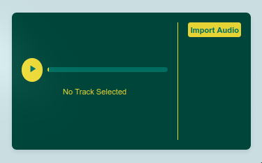

````markdown
# README untuk Pemutar Audio

## Deskripsi

Proyek ini adalah pemutar audio sederhana yang memungkinkan pengguna untuk memutar, menjeda, dan mengelola playlist audio. Audio dapat diunggah dari perangkat dan disimpan di local storage untuk penggunaan selanjutnya.



## Struktur Kode

### 1. Mengambil Playlist dari Local Storage

```javascript
let playlist = JSON.parse(localStorage.getItem("playlist")) || [];
```
````

- **Penjelasan**: Mengambil data playlist yang tersimpan di local storage. Jika tidak ada, inisialisasi dengan array kosong.

### 2. Mengambil Elemen dari DOM

```javascript
const audio = document.getElementById("audio");
const playPauseButton = document.getElementById("play-pause");
const playIcon = document.getElementById("play-icon");
const pauseIcon = document.getElementById("pause-icon");
const progressBar = document.getElementById("progress-bar");
const playlistElement = document.getElementById("playlist");
const audioUpload = document.getElementById("audio-upload");
const currentTrack = document.getElementById("current-track");
```

- **Penjelasan**: Mengambil elemen-elemen yang diperlukan dari DOM untuk interaksi pengguna, seperti elemen audio, tombol, ikon, progress bar, dan elemen playlist.

### 3. Fungsi untuk Membuat Playlist

```javascript
function createPlaylist() {
  // ...
}
```

- **Penjelasan**: Menghasilkan daftar audio berdasarkan data di `playlist`. Setiap lagu ditampilkan sebagai item daftar yang dapat diklik untuk memutar lagu.

### 4. Mengupdate Ikon Putar/Jeda

```javascript
function updatePlayPauseIcon() {
  // ...
}
```

- **Penjelasan**: Memperbarui ikon putar atau jeda berdasarkan status audio (apakah sedang diputar atau dijeda).

### 5. Menyimpan Playlist ke Local Storage

```javascript
function savePlaylist() {
  localStorage.setItem("playlist", JSON.stringify(playlist));
}
```

- **Penjelasan**: Menyimpan data playlist ke local storage dalam format JSON agar dapat diakses di lain waktu.

### 6. Inisialisasi Playlist

```javascript
createPlaylist();
```

- **Penjelasan**: Memanggil fungsi `createPlaylist` untuk menampilkan daftar audio saat aplikasi dimulai.

### 7. Event Listener untuk Mengunggah File Audio

```javascript
audioUpload.addEventListener("change", (event) => {
  // ...
});
```

- **Penjelasan**: Menangani perubahan pada elemen input untuk file audio. Ketika pengguna mengunggah file, file tersebut dibaca dan ditambahkan ke playlist.

### 8. Event Listener untuk Tombol Putar/Jeda

```javascript
playPauseButton.addEventListener("click", () => {
  // ...
});
```

- **Penjelasan**: Mengatur fungsi untuk memutar atau menjeda audio saat tombol diklik.

### 9. Memperbarui Progress Bar

```javascript
audio.addEventListener("timeupdate", () => {
  // ...
});
```

- **Penjelasan**: Mengupdate lebar progress bar berdasarkan waktu pemutaran audio saat ini.

### 10. Reset Ketika Audio Berakhir

```javascript
audio.addEventListener("ended", () => {
  // ...
});
```

- **Penjelasan**: Mengatur status ikon dan progress bar ketika audio telah selesai diputar.

## Cara Menggunakan

1. Unggah file audio menggunakan elemen input.
2. Klik pada lagu di daftar untuk memutarnya.
3. Gunakan tombol putar/jeda untuk mengontrol pemutaran audio.
4. Progress bar akan menunjukkan status pemutaran lagu.

## Catatan

- Pastikan browser mendukung HTML5 audio untuk pemutaran yang lancar.
- Playlist akan disimpan di local storage sehingga tetap ada meskipun halaman dimuat ulang.
