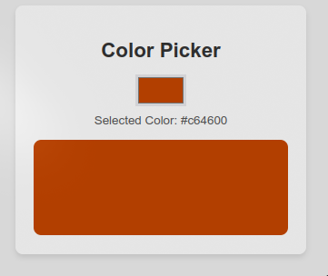

# Color Picker

## Deskripsi

Color Picker adalah aplikasi sederhana yang memungkinkan pengguna untuk memilih warna dari palet dan melihat kode warna serta tampilan warna secara langsung. Aplikasi ini bermanfaat untuk pengembangan web, desain grafis, atau hanya untuk bersenang-senang dengan warna.

 <!-- Ganti dengan path gambar Anda -->

## Daftar Isi

1. [Fitur](#fitur)
2. [Teknologi yang Digunakan](#teknologi-yang-digunakan)
3. [Penjelasan Kode](#penjelasan-kode)
4. [Penggunaan](#penggunaan)
5. [Kesimpulan](#kesimpulan)

## Fitur

- Memilih warna dari input color picker.
- Menampilkan kode warna yang dipilih.
- Mengubah warna latar belakang kotak tampilan sesuai warna yang dipilih.

## Teknologi yang Digunakan

- HTML
- CSS
- JavaScript

## Penjelasan Kode

Berikut adalah penjelasan dari kode yang digunakan dalam proyek ini:

```javascript
document
  .getElementById("colorInput")
  .addEventListener("input", function (event) {
    // Get the selected color from input
    let selectedColor = event.target.value;

    // Update the color text
    document.getElementById("colorCode").textContent = selectedColor;

    // Update the background color of the display box
    document.getElementById("colorDisplay").style.backgroundColor =
      selectedColor;
  });
```

### Penjelasan Kode:

1. **Event Listener**:

   - Kode ini menambahkan event listener pada elemen dengan ID `colorInput`. Event listener ini akan mendengarkan perubahan input warna.

2. **Mengambil Warna yang Dipilih**:

   - Saat pengguna memilih warna, `event.target.value` akan memberikan nilai warna yang dipilih. Nilai ini disimpan dalam variabel `selectedColor`.

3. **Memperbarui Teks Warna**:

   - Kode ini memperbarui elemen dengan ID `colorCode` untuk menampilkan kode warna yang dipilih oleh pengguna.

4. **Mengubah Warna Latar Belakang**:
   - Kode ini juga mengubah warna latar belakang dari elemen dengan ID `colorDisplay` sesuai dengan warna yang dipilih.

## Penggunaan

1. Siapkan file HTML dengan elemen input untuk memilih warna, elemen untuk menampilkan kode warna, dan kotak tampilan warna.
2. Salin kode JavaScript di atas ke dalam file JavaScript terpisah.
3. Buka file HTML di browser untuk melihat dan menggunakan Color Picker.

## Kesimpulan

Color Picker adalah alat yang sederhana namun efektif untuk memilih dan menampilkan warna. Dengan menggunakan JavaScript, aplikasi ini memberikan umpan balik instan kepada pengguna tentang warna yang dipilih.
