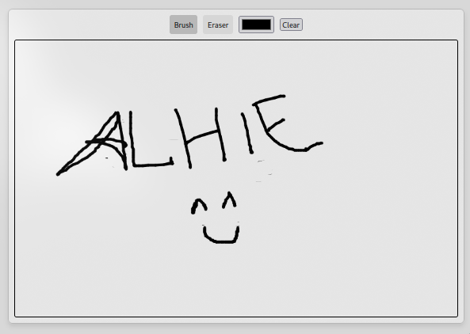

# Drawing App

## Deskripsi

Drawing App adalah aplikasi web interaktif yang memungkinkan pengguna untuk menggambar di canvas menggunakan kuas dan penghapus. Aplikasi ini memungkinkan pengguna untuk memilih warna, mengubah ukuran kuas, dan menghapus gambar yang telah dibuat. Aplikasi ini bertujuan untuk memberikan pengalaman menggambar yang menyenangkan dan kreatif.



## Daftar Isi

1. [Fitur](#fitur)
2. [Teknologi yang Digunakan](#teknologi-yang-digunakan)
3. [Penjelasan Kode](#penjelasan-kode)
4. [Penggunaan](#penggunaan)
5. [Kesimpulan](#kesimpulan)

## Fitur

- Menggambar di canvas menggunakan kuas.
- Menghapus gambar menggunakan penghapus.
- Mengubah warna kuas dengan color picker.
- Tombol untuk menghapus seluruh canvas.

## Teknologi yang Digunakan

- HTML
- CSS
- JavaScript

## Penjelasan Kode

Berikut adalah penjelasan dari kode yang digunakan dalam proyek ini:

```javascript
// Mendapatkan elemen canvas dari HTML dan membuat context 2D untuk menggambar
const canvas = document.getElementById("canvas");
const ctx = canvas.getContext("2d");

// Mendapatkan tombol brush, eraser, tombol clear, dan color picker dari HTML
const brushBtn = document.getElementById("brush");
const eraserBtn = document.getElementById("eraser");
const clearBtn = document.getElementById("clear");
const colorPicker = document.getElementById("colorPicker");

// Mengatur ukuran canvas
canvas.width = 800;
canvas.height = 500;

// Variabel untuk menyimpan status alat dan warna yang digunakan
let painting = false; // Apakah saat ini menggambar atau tidak
let erasing = false; // Apakah saat ini menggunakan penghapus
let currentColor = "#000"; // Warna kuas saat ini
let lineWidth = 5; // Ketebalan garis

// Fungsi untuk memulai menggambar
function startPosition(e) {
  painting = true; // Menandakan bahwa pengguna mulai menggambar
  draw(e); // Memulai menggambar dengan memanggil fungsi draw
}

// Fungsi untuk berhenti menggambar
function endPosition() {
  painting = false; // Menghentikan proses menggambar
  ctx.beginPath(); // Memulai path baru
}

// Fungsi utama untuk menggambar di canvas
function draw(e) {
  if (!painting) return; // Jika tidak sedang menggambar, keluar dari fungsi

  ctx.lineWidth = lineWidth; // Mengatur ketebalan garis
  ctx.lineCap = "round"; // Ujung garis dibulatkan
  ctx.strokeStyle = erasing ? "#fff" : currentColor; // Mengatur warna

  // Menggambar garis berdasarkan posisi mouse
  ctx.lineTo(e.clientX - canvas.offsetLeft, e.clientY - canvas.offsetTop);
  ctx.stroke(); // Menggambar garis pada canvas
  ctx.beginPath(); // Memulai path baru
  ctx.moveTo(e.clientX - canvas.offsetLeft, e.clientY - canvas.offsetTop); // Memindahkan posisi
}

// Fungsi untuk memilih kuas (brush)
function selectBrush() {
  erasing = false; // Menonaktifkan mode penghapus
  brushBtn.classList.add("active"); // Menambahkan kelas "active" pada tombol brush
  eraserBtn.classList.remove("active"); // Menghapus kelas "active" dari tombol eraser
}

// Fungsi untuk memilih penghapus (eraser)
function selectEraser() {
  erasing = true; // Mengaktifkan mode penghapus
  eraserBtn.classList.add("active"); // Menambahkan kelas "active" pada tombol eraser
  brushBtn.classList.remove("active"); // Menghapus kelas "active" dari tombol brush
}

// Fungsi untuk menghapus seluruh canvas
function clearCanvas() {
  ctx.clearRect(0, 0, canvas.width, canvas.height); // Menghapus seluruh area canvas
}

// Fungsi untuk mengganti warna kuas dari input color picker
function changeColor(e) {
  currentColor = e.target.value; // Mengubah warna kuas sesuai input
}

// Menambahkan event listener untuk tombol brush
brushBtn.addEventListener("click", selectBrush);

// Menambahkan event listener untuk tombol eraser
eraserBtn.addEventListener("click", selectEraser);

// Menambahkan event listener untuk tombol clear
clearBtn.addEventListener("click", clearCanvas);

// Menambahkan event listener untuk mengganti warna kuas
colorPicker.addEventListener("input", changeColor);

// Event listener untuk memulai menggambar ketika tombol mouse ditekan
canvas.addEventListener("mousedown", startPosition);

// Event listener untuk berhenti menggambar ketika tombol mouse dilepas
canvas.addEventListener("mouseup", endPosition);

// Event listener untuk menggambar ketika mouse bergerak di atas canvas
canvas.addEventListener("mousemove", draw);
```

### Penjelasan Kode:

1. **Mendapatkan Elemen HTML**:

   - Mengambil elemen canvas dan kontrol (tombol kuas, penghapus, dan color picker) menggunakan `document.getElementById()`.

2. **Mengatur Ukuran Canvas**:

   - Menentukan lebar dan tinggi canvas untuk menggambar.

3. **Variabel Status**:

   - Mendefinisikan variabel untuk status menggambar, warna saat ini, dan ketebalan garis.

4. **Fungsi Menggambar**:

   - Fungsi `draw` menggambar garis berdasarkan posisi mouse jika pengguna dalam mode menggambar.
   - `startPosition` dan `endPosition` mengatur status menggambar saat mouse ditekan atau dilepas.

5. **Pengaturan Alat**:

   - Fungsi untuk memilih alat (kuas atau penghapus) dan mengatur warna sesuai pilihan pengguna.

6. **Event Listeners**:
   - Menambahkan event listener untuk berbagai kontrol dan mouse events untuk memicu fungsi yang sesuai.

## Penggunaan

1. Pastikan Anda memiliki file HTML dengan elemen yang diperlukan (canvas, tombol, color picker).
2. Salin kode di atas ke dalam file JavaScript.
3. Buka file HTML di browser untuk mencoba aplikasi menggambar.

## Kesimpulan

Drawing App adalah aplikasi sederhana yang menawarkan pengalaman menggambar interaktif. Dengan menggunakan JavaScript dan HTML Canvas API, aplikasi ini memungkinkan pengguna untuk mengekspresikan kreativitas mereka dengan cara yang menyenangkan.
