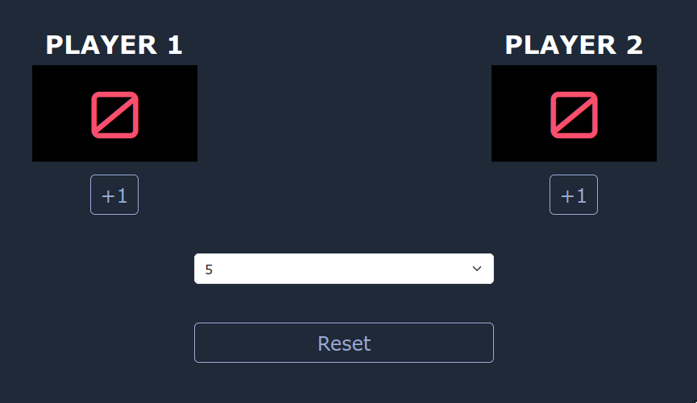

### README: Proyek Papan Skor DOM

#### Daftar Isi

1. [Deskripsi](#deskripsi)
2. [Contoh Kode](#contoh-kode)
3. [Penjelasan Kode](#penjelasan-kode)
4. [Cara Kerja Kode](#cara-kerja-kode)
5. [Kapan Kode Ini Dipakai](#kapan-kode-ini-dipakai)
6. [Analogi Sederhana](#analogi-sederhana)
7. [Kesimpulan](#kesimpulan)

#### Deskripsi

Proyek ini adalah papan skor sederhana yang melacak skor untuk dua pemain. Papan skor ini memungkinkan pemain untuk menambah skor, mereset skor, dan mengatur batas poin kemenangan. Permainan berakhir ketika salah satu pemain mencapai skor yang ditentukan.

<p align="center">
    
</p>

#### Contoh Kode

```javascript
// Memilih elemen tombol dan tampilan skor dari DOM
const p1Button = document.querySelector("#p1-button"); // Tombol untuk Pemain 1
const p2Button = document.querySelector("#p2-button"); // Tombol untuk Pemain 2
const p1Display = document.querySelector("#p1-display"); // Tampilan skor Pemain 1
const p2Display = document.querySelector("#p2-display"); // Tampilan skor Pemain 2
const resetButton = document.querySelector("#reset"); // Tombol reset
const winPointOption = document.querySelector("#winpoint"); // Dropdown untuk memilih poin kemenangan

// Inisialisasi skor dan variabel game
let p1Score = 0; // Skor Pemain 1
let p2Score = 0; // Skor Pemain 2
let winPoint = 3; // Batas poin kemenangan default
let isGameOver = false; // Menunjukkan apakah permainan sudah berakhir

// Fungsi untuk mereset permainan
function reset() {
  isGameOver = false; // Set permainan belum berakhir
  p1Score = 0; // Reset skor Pemain 1
  p2Score = 0; // Reset skor Pemain 2

  // Mengupdate tampilan skor menjadi 0
  p1Display.textContent = 0;
  p2Display.textContent = 0;
}

// Event listener untuk tombol Pemain 1
p1Button.addEventListener("click", function () {
  if (!isGameOver) {
    // Cek apakah permainan belum berakhir
    p1Score += 1; // Tambah skor Pemain 1
    if (p1Score === winPoint) {
      // Cek apakah Pemain 1 mencapai batas kemenangan
      isGameOver = true; // Set permainan berakhir
    }
    p1Display.textContent = p1Score; // Update tampilan skor Pemain 1
  }
});

// Event listener untuk tombol Pemain 2
p2Button.addEventListener("click", function () {
  if (!isGameOver) {
    // Cek apakah permainan belum berakhir
    p2Score += 1; // Tambah skor Pemain 2
    if (p2Score === winPoint) {
      // Cek apakah Pemain 2 mencapai batas kemenangan
      isGameOver = true; // Set permainan berakhir
    }
    p2Display.textContent = p2Score; // Update tampilan skor Pemain 2
  }
});

// Event listener untuk tombol reset
resetButton.addEventListener("click", reset); // Panggil fungsi reset ketika tombol reset diklik

// Event listener untuk dropdown poin kemenangan
winPointOption.addEventListener("change", function () {
  winPoint = parseInt(this.value); // Ambil nilai dari dropdown dan ubah menjadi angka
  reset(); // Reset permainan ketika nilai poin kemenangan diubah
});
```

#### Penjelasan Kode

1. **Pemilihan Elemen**

   - Memilih elemen yang diperlukan dari DOM untuk mengelola interaksi dengan pengguna dan menampilkan skor.

2. **Variabel Skor**

   - Menginisialisasi variabel yang akan menyimpan skor pemain dan status permainan.

3. **Fungsi Reset**

   - Mengatur ulang skor dan status permainan, serta memperbarui tampilan skor di layar.

4. **Event Listener**
   - Menangani klik pada tombol pemain untuk meningkatkan skor dan memeriksa kondisi kemenangan.
   - Menangani klik pada tombol reset untuk mengatur ulang permainan.
   - Menangani perubahan pada dropdown untuk mengubah batas poin kemenangan dan mereset permainan.

#### Cara Kerja Kode

Ketika pengguna mengklik tombol salah satu pemain, skor pemain tersebut meningkat dan tampilan diperbarui. Permainan berakhir saat salah satu pemain mencapai batas poin kemenangan. Pengguna juga dapat mereset permainan kapan saja.

#### Kapan Kode Ini Dipakai

Kode ini berguna dalam situasi di mana Anda memerlukan sistem pelacakan skor sederhana, seperti permainan papan, olahraga, atau aktivitas kompetitif lainnya.

#### Analogi Sederhana

Bayangkan perlombaan di mana dua pemain berlari menuju garis finish. Setiap kali seorang pemain melewati tanda tertentu (mengklik tombol), mereka semakin dekat untuk menang. Jika pemain mencapai garis finish terlebih dahulu, perlombaan berakhir, dan jika mereka ingin mulai lagi, mereka hanya perlu menekan tombol reset.

#### Kesimpulan

Proyek papan skor sederhana ini adalah cara yang bagus untuk belajar tentang manipulasi DOM, penanganan event, dan manajemen status dalam JavaScript. Proyek ini dapat diperluas dengan lebih banyak fitur, menjadikannya titik awal yang fleksibel untuk pengembangan lebih lanjut.
