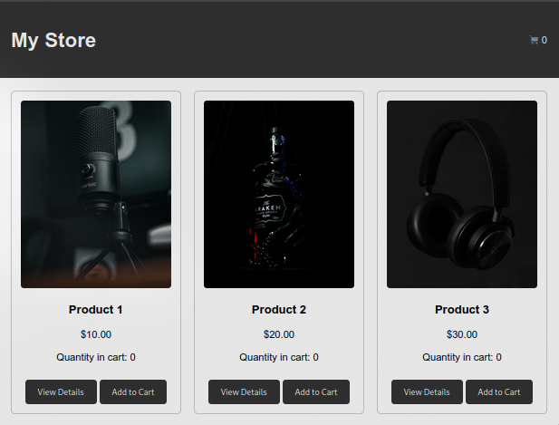

# README: Shopping Cart Project



## Deskripsi Proyek

Proyek ini adalah implementasi sederhana dari sistem keranjang belanja menggunakan JavaScript dengan pendekatan Object-Oriented Programming (OOP). Dalam proyek ini, kita membuat kelas untuk produk, item keranjang, dan keranjang belanja itu sendiri. Proyek ini memungkinkan pengguna untuk melihat produk, menambahkannya ke keranjang, dan mengelola item di dalamnya.

## Konsep OOP yang Digunakan

1. **Encapsulation**: Setiap kelas menyimpan data dan perilakunya sendiri.
2. **Abstraction**: Pengguna dapat berinteraksi dengan objek tanpa mengetahui detail implementasinya.
3. **Inheritance**: Tidak ada contoh langsung dalam kode ini, tetapi bisa digunakan jika kita memiliki kelas lebih lanjut yang memperluas fungsionalitas.

## Struktur Kode

### 1. Kelas Product

```javascript
class Product {
  constructor(id, name, description, price, image) {
    this.id = id; // ID produk
    this.name = name; // Nama produk
    this.description = description; // Deskripsi produk
    this.price = price; // Harga produk
    this.image = image; // URL gambar produk
  }

  // Metode untuk menampilkan kartu produk
  displayCard() {
    return `
              
              <h3>${this.name}</h3>
              <p>$${this.price.toFixed(2)}</p>
              <p id="quantity-${this.id}">Quantity in cart: 0</p>
              <button onclick="shoppingCart.viewProductDetail(${
                this.id
              })">View Details</button>
              <button onclick="shoppingCart.addToCart(${
                this.id
              }, ${true})">Add to Cart</button>
      `;
  }
}
```

- **Deskripsi**: Kelas ini merepresentasikan produk. Metode `displayCard()` digunakan untuk menampilkan informasi produk dalam format HTML.

### 2. Kelas CartItem

```javascript
class CartItem {
  constructor(product, quantity = 1) {
    this.product = product; // Produk yang dimasukkan ke keranjang
    this.quantity = quantity; // Jumlah produk dalam keranjang
  }

  // Metode untuk meningkatkan jumlah produk
  incrementQuantity() {
    this.quantity++;
  }

  // Metode untuk mendapatkan total harga item
  getTotalPrice() {
    return this.quantity * this.product.price;
  }
}
```

- **Deskripsi**: Kelas ini merepresentasikan item di dalam keranjang belanja. Ini menyimpan produk dan jumlahnya, serta memiliki metode untuk menghitung total harga.

### 3. Kelas ShoppingCart

```javascript
class ShoppingCart {
  constructor() {
    this.products = []; // Daftar produk
    this.cart = []; // Daftar item dalam keranjang
  }

  // Metode untuk menambahkan produk
  addProduct(product) {
    this.products.push(product);
  }

  // Metode untuk menampilkan produk
  displayProducts() {
    const productList = document.getElementById("product-list");
    productList.innerHTML = "";
    this.products.forEach((product) => {
      const productCard = document.createElement("div");
      productCard.classList.add("product-card");
      productCard.innerHTML = product.displayCard();
      productList.appendChild(productCard);
    });
  }

  // Metode untuk melihat detail produk
  viewProductDetail(id) {
    const product = this.products.find((p) => p.id === id);
    document.getElementById("detail-image").src = product.image;
    document.getElementById("detail-title").textContent = product.name;
    document.getElementById("detail-description").textContent =
      product.description;
    document.getElementById(
      "detail-price"
    ).textContent = `$${product.price.toFixed(2)}`;
    document
      .getElementById("add-to-cart-btn")
      .setAttribute("onclick", `shoppingCart.addToCart(${product.id})`);
    this.toggleProductDetail();
  }

  // Metode untuk mengubah tampilan modal detail produk
  toggleProductDetail() {
    const modal = document.getElementById("product-modal");
    modal.style.display = modal.style.display === "block" ? "none" : "block";
  }

  // Metode untuk menambahkan produk ke keranjang
  addToCart(id) {
    const product = this.products.find((p) => p.id === id);
    const existingItem = this.cart.find((item) => item.product.id === id);

    if (existingItem) {
      existingItem.incrementQuantity(); // Jika sudah ada, tingkatkan jumlah
    } else {
      this.cart.push(new CartItem(product)); // Tambahkan item baru
    }

    this.updateCart(); // Perbarui tampilan keranjang
    this.updateProductQuantity(id); // Perbarui jumlah produk
  }

  // Metode untuk memperbarui tampilan keranjang
  updateCart() {
    const cartItems = document.getElementById("cart-items");
    cartItems.innerHTML = "";
    let totalPrice = 0;

    this.cart.forEach((item, index) => {
      const itemTotalPrice = item.getTotalPrice();
      totalPrice += itemTotalPrice;

      const li = document.createElement("li");
      li.innerHTML = `${item.product.name} - $${item.product.price.toFixed(
        2
      )} x ${item.quantity} = $${itemTotalPrice.toFixed(
        2
      )}<button onclick="shoppingCart.removeFromCart(${index})">Remove</button>`;
      cartItems.appendChild(li);
    });

    document.getElementById("cart-count").textContent = this.cart.reduce(
      (sum, item) => sum + item.quantity,
      0
    );
    document.getElementById("total-price").textContent = totalPrice.toFixed(2);
  }

  // Metode untuk memperbarui jumlah produk di kartu
  updateProductQuantity(id) {
    const cartItem = this.cart.find((item) => item.product.id === id);
    const quantityElement = document.getElementById(`quantity-${id}`);

    if (cartItem) {
      quantityElement.textContent = `Quantity in cart: ${cartItem.quantity}`;
    } else {
      quantityElement.textContent = `Quantity in cart: 0`;
    }
  }

  // Metode untuk menghapus item dari keranjang
  removeFromCart(index) {
    const removedItem = this.cart.splice(index, 1)[0];
    this.updateCart(); // Perbarui tampilan keranjang
    this.updateProductQuantity(removedItem.product.id); // Perbarui jumlah produk
  }

  // Metode untuk mengubah tampilan keranjang
  toggleCart() {
    const modal = document.getElementById("cart-modal");
    modal.style.display = modal.style.display === "block" ? "none" : "block";
  }
}
```

- **Deskripsi**: Kelas ini mengelola semua fungsionalitas terkait keranjang belanja, termasuk menambahkan produk, menampilkan produk, mengelola jumlah item, dan memperbarui tampilan keranjang.

### Inisialisasi dan Menambahkan Produk

```javascript
const shoppingCart = new ShoppingCart(); // Inisialisasi keranjang belanja

// Menambahkan produk ke keranjang
shoppingCart.addProduct(
  new Product(
    1,
    "Product 1",
    "This is the description for Product 1",
    10.0,
    "image_url_1"
  )
);
shoppingCart.addProduct(
  new Product(
    2,
    "Product 2",
    "This is the description for Product 2",
    20.0,
    "image_url_2"
  )
);
shoppingCart.addProduct(
  new Product(
    3,
    "Product 3",
    "This is the description for Product 3",
    30.0,
    "image_url_3"
  )
);

shoppingCart.displayProducts(); // Menampilkan produk yang ada
```

- **Deskripsi**: Bagian ini menginisialisasi keranjang belanja dan menambahkan beberapa produk.

### Menangani Event Klik

```javascript
window.onclick = function (event) {
  const cartModal = document.getElementById("cart-modal");
  const productModal = document.getElementById("product-modal");

  if (event.target == cartModal) {
    cartModal.style.display = "none"; // Menutup modal keranjang saat diklik di luar
  }
  if (event.target == productModal) {
    productModal.style.display = "none"; // Menutup modal detail produk saat diklik di luar
  }
};
```

- **Deskripsi**: Kode ini mengatur agar modal tutup ketika pengguna mengklik di luar modal.

## Analogi Sederhana

Bayangkan Anda memiliki toko buku. Setiap buku adalah **produk** (dalam kelas `Product`), dan ketika Anda memilih buku untuk dibeli, Anda menambahkannya ke **keranjang** (dalam kelas `ShoppingCart`). Setiap buku yang ada di keranjang disebut **item keranjang** (dalam kelas `CartItem`). Saat Anda melihat detail buku atau menambahkannya ke keranjang, Anda melakukan tindakan yang sama dengan yang dilakukan di aplikasi ini.

## Kesimpulan

Proyek ini menggunakan konsep OOP untuk menciptakan sistem keranjang belanja yang terstruktur dan mudah dikelola. Dengan memisahkan fungsionalitas ke dalam kelas yang berbeda, kode menjadi lebih bersih, lebih mudah dipahami, dan lebih mudah untuk dikembangkan di masa depan. Proyek ini memberikan dasar yang kuat untuk memahami cara kerja OOP dalam JavaScript dan dapat diperluas untuk menambahkan lebih banyak fitur di kemudian hari.
