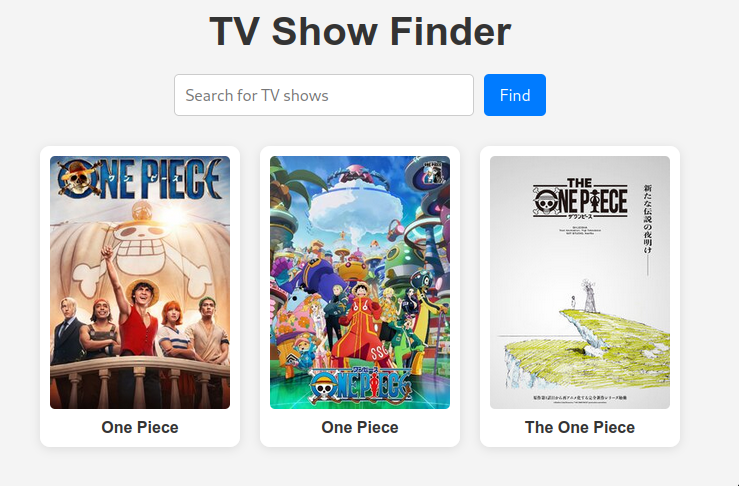

# Daftar Acara TV dengan Axios

## Deskripsi

Proyek ini adalah aplikasi web sederhana yang memungkinkan pengguna mencari acara TV menggunakan API dari TVmaze. Dengan memasukkan kata kunci pencarian, pengguna dapat melihat gambar dan nama dari acara TV yang sesuai dengan pencarian tersebut.

<p align="center">
    
</p>

## Fitur

- Mencari acara TV berdasarkan kata kunci.
- Menampilkan gambar dan nama acara TV yang relevan.
- Menghapus gambar sebelumnya saat melakukan pencarian baru.

## Teknologi yang Digunakan

- HTML
- CSS
- JavaScript
- Axios (untuk melakukan permintaan HTTP)
- API TVmaze

## Daftar Isi

1. [Instalasi](#instalasi)
2. [Cara Menggunakan](#cara-menggunakan)
3. [Penjelasan Kode](#penjelasan-kode)
4. [Kesimpulan](#kesimpulan)

## Instalasi

1. Clone repositori ini:
   ```bash
   git clone https://github.com/username/repo-name.git
   ```
2. Buka file `index.html` di browser Anda.

## Cara Menggunakan

1. Buka aplikasi di browser.
2. Masukkan kata kunci acara TV yang ingin dicari di kolom pencarian.
3. Klik tombol submit atau tekan Enter.
4. Gambar dan nama acara TV yang cocok dengan pencarian akan ditampilkan di halaman.

## Penjelasan Kode

### Kode Utama

```javascript
document.addEventListener("DOMContentLoaded", () => {
  const form = document.querySelector("#search-form");
```

- **Deskripsi**: Menambahkan event listener yang akan dijalankan setelah semua elemen DOM dimuat. Ini memastikan bahwa semua elemen yang ingin kita akses sudah ada.
- **Tujuan**: Memfasilitasi akses ke elemen form untuk menambahkan event listener.

```javascript
  form.addEventListener("submit", async (e) => {
    e.preventDefault(); // Mencegah reload halaman
```

- **Deskripsi**: Menambahkan event listener untuk menangani event `submit` pada form. `async` menandakan bahwa fungsi ini akan melakukan operasi asynchronous.
- **Tujuan**: `e.preventDefault()` mencegah form dari reload halaman saat disubmit.

```javascript
document.querySelectorAll(".result-item").forEach((div) => div.remove());
```

- **Deskripsi**: Menghapus semua elemen dengan kelas `result-item` sebelum menampilkan hasil pencarian baru.
- **Tujuan**: Menjaga tampilan tetap bersih dan hanya menampilkan hasil terbaru.

```javascript
const keyword = form.elements.query.value; // Mengambil nilai dari input
const config = {
  params: { q: keyword }, // Menyiapkan parameter pencarian
};
```

- **Deskripsi**: Mengambil nilai dari input dengan nama `query` di form dan menyiapkan objek konfigurasi untuk Axios.
- **Tujuan**: Parameter `q` berisi kata kunci yang dimasukkan pengguna dan akan digunakan dalam permintaan ke API.

```javascript
const res = await axios.get(`https://api.tvmaze.com/search/shows`, config);
```

- **Deskripsi**: Melakukan permintaan GET ke API TVmaze untuk mencari acara TV berdasarkan kata kunci.
- **Tujuan**: `await` digunakan untuk menunggu hingga respons diterima sebelum melanjutkan ke baris berikutnya.

```javascript
getImages(res.data); // Mengambil dan menampilkan gambar
```

- **Deskripsi**: Memanggil fungsi `getImages` dan meneruskan data acara TV yang diterima dari API.
- **Tujuan**: Memproses data dan menampilkan gambar serta nama acara TV.

```javascript
form.elements.query.value = ""; // Mengosongkan input
```

- **Deskripsi**: Mengosongkan kolom input pencarian setelah pengguna mengirimkan form.
- **Tujuan**: Memudahkan pengguna untuk melakukan pencarian baru tanpa harus menghapus input secara manual.

### Fungsi `getImages`

```javascript
const getImages = (shows) => {
  const resultsContainer = document.querySelector(".results"); // Mengambil kontainer hasil
```

- **Deskripsi**: Mendefinisikan fungsi `getImages` yang menerima parameter `shows`, merupakan array hasil pencarian.
- **Tujuan**: Menyediakan tempat untuk menampilkan hasil pencarian.

```javascript
  for (let result of shows) {
    if (result.show.image) { // Memastikan ada gambar
      const img = document.createElement("img"); // Membuat elemen gambar
      img.src = result.show.image.medium; // Mengatur sumber gambar
```

- **Deskripsi**: Melakukan iterasi melalui setiap acara TV dan memeriksa apakah ada gambar.
- **Tujuan**: Hanya menampilkan gambar jika ada.

```javascript
const title = document.createElement("p"); // Membuat elemen paragraf untuk nama acara
title.textContent = result.show.name; // Mengatur teks nama acara
```

- **Deskripsi**: Membuat elemen paragraf untuk menampilkan nama acara.
- **Tujuan**: Menampilkan nama acara di bawah gambar.

```javascript
const container = document.createElement("div"); // Membuat kontainer untuk gambar dan nama
container.classList.add("result-item"); // Menambahkan kelas untuk styling
container.append(img); // Menambahkan gambar ke kontainer
container.append(title); // Menambahkan nama acara ke kontainer
```

- **Deskripsi**: Membuat kontainer untuk menampung gambar dan judul acara.
- **Tujuan**: Menyusun elemen agar terorganisir dan mudah dinamis dalam tampilan.

```javascript
      resultsContainer.append(container); // Menambahkan kontainer ke hasil
    }
  }
};
```

- **Deskripsi**: Menambahkan kontainer hasil (yang berisi gambar dan judul) ke dalam kontainer hasil utama.
- **Tujuan**: Menampilkan gambar dan nama acara TV di halaman web.

## Kesimpulan

Proyek ini merupakan contoh yang baik untuk belajar tentang penggunaan Axios untuk melakukan permintaan API, pengelolaan DOM untuk menampilkan data, dan interaksi pengguna di aplikasi web. Anda dapat mengembangkan proyek ini lebih lanjut dengan menambahkan fitur tambahan seperti detail acara, rating, atau deskripsi untuk setiap acara.
