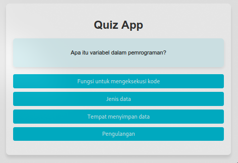

# Quiz App

## Deskripsi

Quiz App adalah aplikasi interaktif yang dirancang untuk menguji pengetahuan dasar pengguna tentang pemrograman. Aplikasi ini memberikan pertanyaan dan opsi jawaban, memungkinkan pengguna untuk memilih jawaban dan mendapatkan umpan balik berdasarkan pilihan mereka. Dengan antarmuka yang sederhana, aplikasi ini bertujuan untuk membuat proses pembelajaran lebih menyenangkan.



## Cara Kerja Aplikasi

1. **Pertanyaan dan Jawaban**: Aplikasi ini menyimpan array yang berisi pertanyaan dan jawaban. Setiap pertanyaan memiliki beberapa jawaban, di mana satu jawaban benar.

2. **Memulai Kuis**: Pengguna dapat memulai kuis, yang akan menampilkan pertanyaan satu per satu.

3. **Memilih Jawaban**: Setelah memilih jawaban, pengguna mendapatkan umpan balik dan bisa melanjutkan ke pertanyaan berikutnya.

4. **Menampilkan Skor**: Setelah semua pertanyaan dijawab, aplikasi menampilkan skor pengguna.

## Struktur Kode

Berikut adalah penjelasan kode utama yang digunakan dalam aplikasi:

### Pertanyaan dan Jawaban

```javascript
const questions = [
  {
    question: "Apa itu variabel dalam pemrograman?",
    answers: [
      { text: "Fungsi untuk mengeksekusi kode", correct: false },
      { text: "Jenis data", correct: false },
      { text: "Tempat menyimpan data", correct: true },
      { text: "Pengulangan", correct: false },
    ],
  },
  // ... pertanyaan lainnya
];
```

- **`questions`**: Array yang berisi objek pertanyaan. Setiap objek memiliki dua atribut:
  - `question`: Teks dari pertanyaan.
  - `answers`: Array dari objek yang masing-masing berisi `text` (jawaban) dan `correct` (boolean yang menunjukkan apakah jawaban tersebut benar).

### Memulai Kuis

```javascript
function startQuiz() {
  currentQuestionIndex = 0; // Mengatur indeks pertanyaan saat ini ke 0
  score = 0; // Mengatur skor pengguna ke 0
  nextButton.style.display = "none"; // Menyembunyikan tombol Next
  resultContainer.style.display = "none"; // Menyembunyikan hasil
  questionContainer.style.display = "block"; // Menampilkan container pertanyaan
  showQuestion(); // Menampilkan pertanyaan pertama
}
```

- **`startQuiz()`**: Fungsi ini menginisialisasi kuis dengan mengatur variabel yang diperlukan dan menampilkan pertanyaan pertama.

### Menampilkan Pertanyaan

```javascript
function showQuestion() {
  resetState(); // Mengatur ulang state tampilan jawaban
  const currentQuestion = questions[currentQuestionIndex]; // Mengambil pertanyaan saat ini
  questionElement.textContent = currentQuestion.question; // Menampilkan teks pertanyaan

  // Membuat tombol untuk setiap jawaban
  currentQuestion.answers.forEach((answer) => {
    const button = document.createElement("button"); // Membuat elemen button
    button.textContent = answer.text; // Mengatur teks button
    button.classList.add("answer-btn"); // Menambahkan kelas untuk styling
    if (answer.correct) {
      button.dataset.correct = answer.correct; // Menyimpan informasi jika jawaban benar
    }
    button.addEventListener("click", selectAnswer); // Menambahkan event listener untuk mengelola klik
    answerButtons.appendChild(button); // Menambahkan button ke container jawaban
  });
}
```

- **`showQuestion()`**: Fungsi ini menampilkan pertanyaan dan jawaban saat ini, serta membuat tombol untuk setiap jawaban.

### Mengatur Ulang State

```javascript
function resetState() {
  nextButton.style.display = "none"; // Menyembunyikan tombol Next
  while (answerButtons.firstChild) {
    answerButtons.removeChild(answerButtons.firstChild); // Menghapus semua tombol jawaban
  }
}
```

- **`resetState()`**: Fungsi ini digunakan untuk menghapus jawaban yang sebelumnya ditampilkan dan menyembunyikan tombol Next.

### Memilih Jawaban

```javascript
function selectAnswer(e) {
  const selectedButton = e.target; // Mengambil button yang dipilih
  const correct = selectedButton.dataset.correct === "true"; // Memeriksa apakah jawaban benar
  if (correct) {
    score++; // Menambah skor jika jawaban benar
    selectedButton.style.backgroundColor = "#4caf50"; // Mengubah warna background menjadi hijau
  } else {
    selectedButton.style.backgroundColor = "#f44336"; // Mengubah warna background menjadi merah
  }

  // Menonaktifkan semua button jawaban
  Array.from(answerButtons.children).forEach((button) => {
    button.disabled = true; // Menonaktifkan button
    if (button.dataset.correct) {
      button.style.backgroundColor = "#4caf50"; // Menandai jawaban benar
    }
  });

  // Menampilkan tombol Next jika masih ada pertanyaan
  if (currentQuestionIndex < questions.length - 1) {
    nextButton.style.display = "inline-block"; // Menampilkan tombol Next
  } else {
    showResult(); // Menampilkan hasil jika semua pertanyaan telah dijawab
  }
}
```

- **`selectAnswer()`**: Fungsi ini menangani interaksi ketika pengguna memilih jawaban, memberikan umpan balik visual dan menghitung skor.

### Menampilkan Hasil

```javascript
function showResult() {
  questionContainer.style.display = "none"; // Menyembunyikan container pertanyaan
  resultContainer.style.display = "block"; // Menampilkan container hasil
  scoreElement.textContent = `Your score: ${score} / ${questions.length}`; // Menampilkan skor akhir
}
```

- **`showResult()`**: Fungsi ini menampilkan hasil akhir dan skor pengguna setelah semua pertanyaan dijawab.

### Event Listener untuk Tombol Next dan Restart

```javascript
nextButton.addEventListener("click", () => {
  currentQuestionIndex++; // Meningkatkan indeks pertanyaan
  showQuestion(); // Menampilkan pertanyaan berikutnya
});

restartButton.addEventListener("click", startQuiz); // Mengatur ulang kuis saat tombol restart ditekan
```

- **Event Listener**: Menangani klik pada tombol Next dan Restart untuk navigasi antara pertanyaan dan memulai ulang kuis.

## Instalasi

1. **Clone atau Unduh Proyek**:

   ```bash
   git clone [URL_PROYEK]
   cd [NAMA_FOLDER]
   ```

2. **Buka `index.html` di Browser**:
   Klik dua kali pada file `index.html` untuk menjalankan aplikasi.
