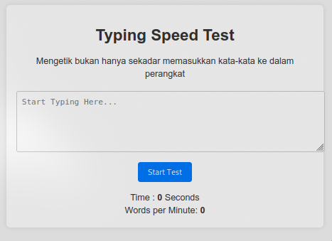

# Proyek Typing Text



## Deskripsi

Proyek Typing Text adalah aplikasi web sederhana yang dirancang untuk menguji kemampuan mengetik pengguna. Aplikasi ini menampilkan teks yang harus diketik oleh pengguna dan memberikan umpan balik secara real-time tentang akurasi dan kecepatan mengetik dalam kata per menit (WPM).

## Fitur

- Menampilkan teks yang harus diketik.
- Menghitung dan menampilkan waktu yang telah berlalu.
- Menghitung kata per menit (WPM).
- Memberikan umpan balik visual untuk kata yang diketik dengan benar atau salah.

## Struktur Proyek

- `index.html`: Berisi markup HTML untuk antarmuka pengguna.
- `style.css`: Menyediakan gaya dan tata letak untuk aplikasi.
- `script.js`: Mengandung logika JavaScript untuk interaktivitas aplikasi.

## Instalasi

1. Clone repositori ini ke komputer Anda.
2. Buka `index.html` di browser Anda.

## Penjelasan Kode

### 1. Mendapatkan Elemen HTML

```javascript
// Ambil elemen HTML yang diperlukan berdasarkan ID
const textToTypeElement = document.getElementById("text-to-type"); // Elemen yang menampilkan teks yang harus diketik
const textToType = textToTypeElement.innerText.split(" "); // Memecah teks menjadi array kata
const userInput = document.getElementById("user-input"); // Elemen input untuk pengguna
const startButton = document.getElementById("start-button"); // Tombol untuk memulai tes
const timeDisplay = document.getElementById("time"); // Elemen untuk menampilkan waktu yang berlalu
const wpmDisplay = document.getElementById("words-per-minute"); // Elemen untuk menampilkan kata per menit
```

**Penjelasan**: Di sini, kita mengambil elemen-elemen HTML yang diperlukan untuk aplikasi menggunakan `getElementById()`. Teks yang akan diketik dipecah menjadi array kata untuk memudahkan pemeriksaan saat pengguna mengetik.

### 2. Variabel Global

```javascript
let startTime; // Menyimpan waktu saat tes dimulai
let timerInterval; // Menyimpan interval timer untuk memperbarui waktu
```

**Penjelasan**: Variabel `startTime` akan menyimpan waktu ketika tes dimulai, sementara `timerInterval` digunakan untuk menyimpan ID dari interval yang digunakan untuk memperbarui waktu setiap detik.

### 3. Memulai Tes

```javascript
// Fungsi untuk memulai tes
function startTest() {
  startTime = new Date(); // Menyimpan waktu saat tes dimulai
  userInput.value = ""; // Mengosongkan input pengguna
  userInput.focus(); // Mengarahkan fokus ke input pengguna
  timerInterval = setInterval(updateTimer, 1000); // Memulai timer untuk memperbarui setiap detik
  textToTypeElement.innerHTML = textToType
    .map((word) => `<span>${word}</span>`) // Membungkus setiap kata dalam elemen <span>
    .join(" "); // Menggabungkan kembali kata-kata menjadi string
}
```

**Penjelasan**: Fungsi `startTest()` mempersiapkan tes dengan mencatat waktu mulai, mengosongkan input pengguna, dan memulai timer. Teks yang harus diketik juga ditampilkan dalam format yang lebih mudah untuk dipantau, dengan setiap kata dibungkus dalam elemen `<span>`.

### 4. Memperbarui Timer

```javascript
function updateTimer() {
  const currentTime = new Date(); // Mendapatkan waktu saat ini
  const elapsedTime = Math.floor((currentTime - startTime) / 1000); // Menghitung waktu yang telah berlalu dalam detik
  timeDisplay.innerText = elapsedTime; // Menampilkan waktu yang telah berlalu
}
```

**Penjelasan**: Fungsi `updateTimer()` menghitung waktu yang telah berlalu sejak tes dimulai dan memperbarui tampilan waktu di antarmuka pengguna.

### 5. Menghitung Kata per Menit (WPM)

```javascript
function calculateWPM() {
  const wordsTyped = userInput.value.trim().split(/\s+/).length; // Menghitung jumlah kata yang diketik
  const currentTime = new Date(); // Mendapatkan waktu saat ini
  const elapsedTime = Math.floor((currentTime - startTime) / 1000); // Menghitung waktu yang telah berlalu dalam detik
  const minutes = elapsedTime / 60; // Mengonversi detik menjadi menit
  const wpm = Math.floor(wordsTyped / minutes); // Menghitung kata per menit
  wpmDisplay.innerHTML = wpm; // Menampilkan WPM
}
```

**Penjelasan**: Fungsi `calculateWPM()` menghitung jumlah kata yang diketik, mengonversi waktu yang berlalu menjadi menit, dan kemudian menghitung kata per menit. Hasilnya ditampilkan di antarmuka pengguna.

### 6. Memeriksa Input Pengguna

```javascript
function checkInput() {
  const typedText = userInput.value.trim().split(" "); // Memecah input pengguna menjadi array kata
  const spans = textToTypeElement.querySelectorAll("span"); // Mengambil semua elemen <span> yang berisi kata

  typedText.forEach((word, index) => {
    // Loop melalui setiap kata yang diketik
    if (spans[index]) {
      // Memeriksa apakah ada span yang sesuai
      if (word === textToType[index]) {
        // Memeriksa apakah kata yang diketik benar
        spans[index].className = "correct"; // Menandai kata sebagai benar
      } else {
        spans[index].className = "incorrect"; // Menandai kata sebagai salah
      }
    }
  });

  // Menghapus kelas jika pengguna menghapus teks yang sudah diketik sebelumnya
  for (let i = typedText.length; i < spans.length; i++) {
    spans[i].className = ""; // Menghapus kelas dari span yang tidak ada inputnya
  }
}
```

**Penjelasan**: Fungsi `checkInput()` memeriksa setiap kata yang diketik oleh pengguna. Jika kata tersebut sesuai dengan teks yang ditampilkan, maka kata tersebut ditandai dengan kelas "correct". Jika tidak, ditandai dengan kelas "incorrect". Selain itu, fungsi ini juga menghapus kelas untuk kata yang telah dihapus oleh pengguna.

### 7. Menghentikan Tes

```javascript
function stopTest() {
  clearInterval(timerInterval); // Menghentikan timer
  calculateWPM(); // Menghitung dan menampilkan WPM
}
```

**Penjelasan**: Fungsi `stopTest()` digunakan untuk menghentikan tes. Ia menghentikan timer dan menghitung kata per menit ketika pengguna menyelesaikan mengetik teks.

### 8. Event Listener

```javascript
startButton.addEventListener("click", () => {
  startTest(); // Memulai tes saat tombol diklik
});

userInput.addEventListener("input", () => {
  checkInput(); // Memeriksa input saat pengguna mengetik
  const typedText = userInput.value;
  if (typedText.trim() === textToType.join(" ")) {
    // Memeriksa apakah semua teks telah diketik
    stopTest(); // Menghentikan tes jika selesai
  }
});
```

**Penjelasan**: Dua event listener ditambahkan di sini:

- Yang pertama untuk tombol "Start", yang memanggil fungsi `startTest()` ketika diklik.
- Yang kedua untuk input pengguna, yang memanggil `checkInput()` saat pengguna mengetik. Jika pengguna berhasil mengetik semua teks, fungsi `stopTest()` akan dipanggil untuk menghentikan tes.

## Cara Menggunakan

1. Klik tombol "Start" untuk memulai tes.
2. Ketik teks yang muncul di layar.
3. Perhatikan waktu yang berlalu dan WPM yang dihitung secara otomatis.
4. Tes akan berhenti secara otomatis setelah Anda selesai mengetik semua teks.

## Kontribusi

Jika Anda memiliki saran atau perbaikan, silakan buat pull request atau buka isu.
