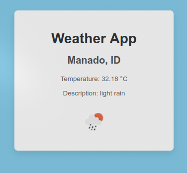

# Weather App



## Deskripsi

Weather App adalah aplikasi web yang menampilkan informasi cuaca berdasarkan lokasi pengguna menggunakan API OpenWeather Map. Aplikasi ini memanfaatkan fitur geolokasi untuk mendapatkan koordinat pengguna dan menampilkan data cuaca yang relevan.

## Daftar Isi

1. [Fitur](#fitur)
2. [Teknologi yang Digunakan](#teknologi-yang-digunakan)
3. [Penjelasan Kode](#penjelasan-kode)
4. [Penggunaan](#penggunaan)
5. [Cara Menjalankan Proyek](#cara-menjalankan-proyek)
6. [Penanganan Error](#penanganan-error)
7. [Kesimpulan](#kesimpulan)

## Fitur

- Mengambil lokasi pengguna secara otomatis menggunakan geolokasi.
- Menampilkan suhu, deskripsi cuaca, dan ikon cuaca.
- Menyediakan pesan kesalahan jika data cuaca gagal diambil.

## Teknologi yang Digunakan

- HTML
- CSS
- JavaScript
- API OpenWeather Map

## Penjelasan Kode

Berikut adalah penjelasan dari kode yang digunakan dalam proyek ini:

```javascript
const apiKey = "51e034840776cf8ea4fe0b9087c468a2"; // API key untuk mengakses OpenWeather Map

// Ambil elemen HTML yang diperlukan
const locationElement = document.getElementById("location"); // Elemen untuk menampilkan lokasi
const temperatureElement = document.getElementById("temperature"); // Elemen untuk menampilkan suhu
const descriptionElement = document.getElementById("description"); // Elemen untuk menampilkan deskripsi cuaca
const weathericonElement = document.getElementById("weather-icon"); // Elemen untuk menampilkan ikon cuaca

// Fungsi untuk mendapatkan cuaca dari OpenWeather Map
async function getWeather(latitude, longitude) {
  const apiURL = `https://api.openweathermap.org/data/2.5/weather?lat=${latitude}&lon=${longitude}&units=metric&appid=${apiKey}`;

  try {
    const res = await fetch(apiURL); // Mengambil data dari API
    const data = await res.json(); // Mengonversi respons menjadi JSON

    // Menampilkan data cuaca ke elemen HTML
    locationElement.textContent = `${data.name}, ${data.sys.country}`; // Menampilkan nama lokasi dan negara
    temperatureElement.textContent = `Temperature: ${data.main.temp} °C`; // Menampilkan suhu
    descriptionElement.textContent = `Description: ${data.weather[0].description}`; // Menampilkan deskripsi cuaca

    const iconCode = data.weather[0].icon; // Mengambil kode ikon cuaca
    weathericonElement.innerHTML = ``; // Menampilkan ikon cuaca
  } catch (error) {
    console.error("Error fetching weather data: "); // Mencetak error di console
    alert("Failed to fetch weather data. Please try again later"); // Menampilkan pesan kesalahan
  }
}

// Fungsi untuk mendapatkan lokasi pengguna
function getLocation() {
  if (navigator.geolocation) {
    navigator.geolocation.getCurrentPosition(
      (position) => {
        const latitude = position.coords.latitude; // Mengambil latitude
        const longitude = position.coords.longitude; // Mengambil longitude
        getWeather(latitude, longitude); // Memanggil fungsi untuk mendapatkan cuaca
      },
      (error) => {
        alert("Failed to get your location. Please enable location services"); // Pesan jika lokasi tidak dapat diambil
      }
    );
  } else {
    alert("Geolocation is not supported by your browser"); // Pesan jika geolocation tidak didukung
  }
}

// Memanggil fungsi getLocation ketika halaman dimuat
window.onload = getLocation;
```

### Penjelasan Kode:

1. **Inisialisasi API Key**: API key disimpan dalam variabel `apiKey`, yang diperlukan untuk mengakses API OpenWeather Map.

2. **Pengambilan Elemen HTML**: Elemen HTML untuk menampilkan lokasi, suhu, deskripsi cuaca, dan ikon cuaca diambil menggunakan `document.getElementById()`.

3. **Fungsi `getWeather`**:

   - Menerima latitude dan longitude sebagai argumen.
   - Menggunakan `fetch` untuk mengambil data cuaca dari API.
   - Mengonversi respons menjadi format JSON.
   - Menampilkan nama lokasi, suhu, deskripsi, dan ikon cuaca ke elemen HTML yang sesuai.

4. **Fungsi `getLocation`**:

   - Memeriksa apakah geolocation didukung oleh browser.
   - Mengambil posisi pengguna dan memanggil `getWeather` dengan latitude dan longitude yang diperoleh.

5. **Memanggil `getLocation`**: Ketika halaman dimuat, fungsi `getLocation` dipanggil secara otomatis untuk mendapatkan cuaca berdasarkan lokasi pengguna.

## Penggunaan

1. Pastikan Anda memiliki koneksi internet.
2. Salin kode di atas ke dalam file HTML dan JavaScript.
3. Buka file HTML di browser.
4. Izinkan akses lokasi saat diminta.
5. Aplikasi akan secara otomatis mengambil dan menampilkan data cuaca.

## Penanganan Error

- Jika pengguna menolak akses geolokasi, aplikasi akan menampilkan pesan kesalahan.
- Jika ada kesalahan saat mengambil data cuaca, aplikasi akan menangani kesalahan dan memberi tahu pengguna.

## Kesimpulan

Weather App adalah proyek yang berguna untuk memahami cara mengambil dan menampilkan data dari API menggunakan JavaScript. Dengan memanfaatkan geolokasi, aplikasi ini memberikan informasi cuaca yang relevan berdasarkan lokasi pengguna. Anda dapat mengembangkan proyek ini lebih lanjut dengan menambahkan fitur seperti pencarian lokasi manual atau memperbaiki antarmuka pengguna.
